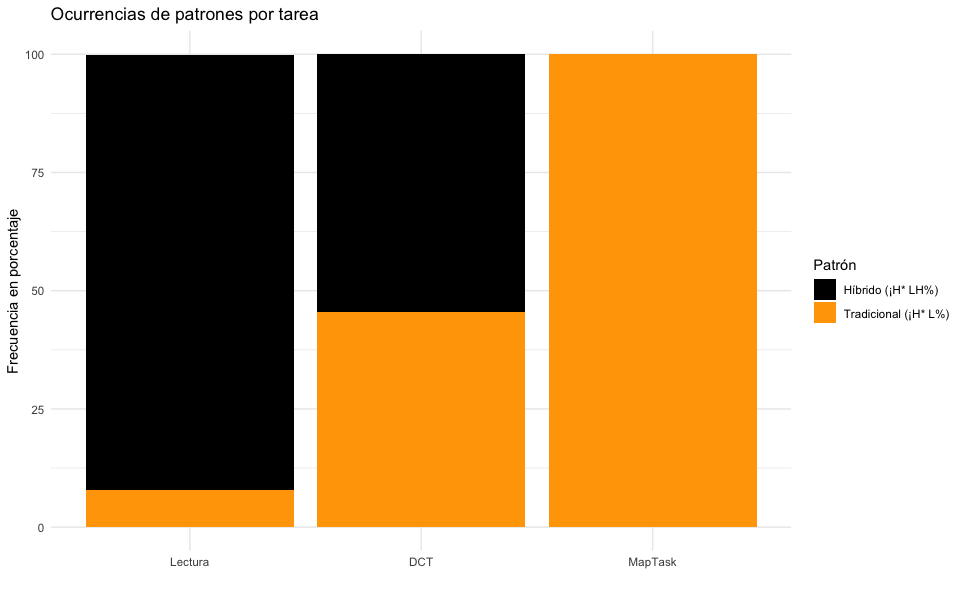

# Análisis de datos nominales

## Antes de empezar
Vamos a usar algunos paquetes de R
Para instalarlos escribid en el terminal de R (la parte de abajo de RStudio)
```R
install.packages("readxl","dplyr","ggplot2","plyr")
```
## El contenido de la sesión
1. Cargar una base de datos en formato Excel (no le digáis a ningún data analist que los lingüistas usamos excel, nos reñirán mucho)
2. Variables factor: importancia y conversión de char a factor
3. Tablas de contingencia (cálculo de frecuencias)
4. Gráficos de barras con ggplot (crear y guardar)
5. Estadística inferencial para datos nominales (chi-square y test exacto de Fisher)

## Los datos
Vamos a trabajar con datos de anotación entonativa que han sido publicados en:

Elvira-García, Wendy. 2020. [Fusión de patrones entonativos en variedades lingüísticas en contacto: el caso de las interrogativas del español de León](http://www.sintagma.udl.cat/export/sites/Sintagma/documents/articles_32/Sintagma-32_5.pdf). Sintagma, 32, 71-84. 10.21001/sintagma.2020.32.05

Los datos tienen esta pinta:

Archivo | Tarea | Patrón
------------ | ------------- | -------------
wl61pwpi1.wav | Lectura | ¡H* LH%
wl61pwpi2.wav | Lectura | ¡H* LH%
hora1.wav | Inducido | ¡H* LH%
hora2.wav | Inducido | ¡H* L%
casaspequenas1.wav | Maptask | ¡H* L%

## La extracción de esos datos
En esta clase vamos a trabajar con esa base de datos ya preparada en un archivo Excel, pero si queréis conseguir una base de datos igual a partir de vuestros TextGrids, previamente tendríais que usar un script de Praat para extraer la anotación (labels de un tier de puntos) de vuestros archivos. Por ejemplo, este:
 * [point_label_extraction](https://github.com/wendyelviragarcia/TextGrid_labels_extraction):


## Algunos resultados esperables para abrir boca


