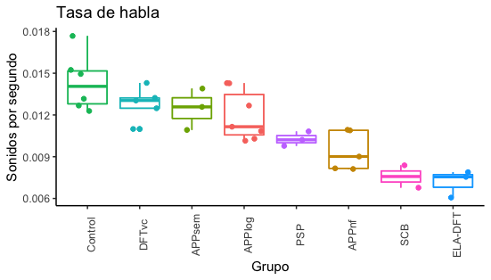

# Análisis de datos numéricos (o variables continuas)

## Antes de empezar
Vamos a usar algunos paquetes de R
Para instalarlos escribid en el terminal de R (la parte de abajo de RStudio)
```R
install.packages("dplyr","ggplot2","plyr")
```
## El contenido de la sesión
1. Cargar una base de datos en formato csv (hoy sí que los de mates estarían orgullosos de nosotros)
2. Variables factor: importancia y conversión de char a factor
3. Descriptivos
4. Gráficos de cajas y bigotes (crear y guardar)
5. Estadística inferencial para datos numéricos (comprobación de la normalidad, anova y Mann-Whitney y post-hocs)

## Archivos necesarios
Para seguir la sesión descarga en tu ordenador el [script de R]() y la [base de datos que usaremos](). Son los archivos que están en esta misma carpeta (también puedes seguir los links).

## Información sobre los datos
Vamos a trabajar con datos de ritmo que han sido publicados en:

Elvira-García, Wendy y Marrero, Victoria. 2020. [El ritmo y la tasa de habla como ayuda diagnóstica en síndromes neurodegenerativos de los lóbulos fronto-temporales](http://www.doi.org/10.3989/loquens.2020.068). Loquens, 7(1), e068. 10.3989/loquens.2020.068

El ritmo se mide en muchas métricas diferentes (no hay un consenso claro sobre cuáles usar). En esta clase vamos a ver algunas. Específicamente, la tasa de habla (en sonidos por segundo), el porcentaje de consonantes (del tiempo de habla total), el varco de las consonantes (Dellwo et Wagner, 2003) y el rPVI-C. Los grupos que analizaremos son Controles vs pacientes diagnosticados con algún tipo de afasia progresiva primaria (demencia).


Los datos tienen esta pinta:

id | Diagnóstico | TasaDeHabla| Porcentaje de Consonantes | varcoC
------------ | ------------- | -------------| -------------| -------------
1 | Control | 0.015| 63.15|16.40
2 | Control | 0.018| 58.41|15.58
3 | APP_sem | 0.013| 55.55| 20.66
4 | APP_log | 0.010| 50.35|26.36
5 | ELA | 0.006| 34.23| 16.18

## La extracción de esos datos
En esta clase vamos a trabajar con esa base de datos ya preparada en un archivo CSV (comma separated file), pero si queréis conseguir una base de datos igual a partir de vuestros TextGrids, previamente tendríais que usar un script de Praat calcular la tasa de habla y/o diferentes métricas de ritmo de vuestros archivos. También, si tenéis vuestros TextGrids preparados podriáis usar esto: 
 * [Web-app de shiny para calcular parámetros de ritmo]( https://wendyelvira.shinyapps.io/ritmo/)

## Cómo aplicar este análisis a otros datos
Este mismo análisis se puede aplicar a otros datos en los que haya un resultado para cada hablante o fichero. Por ejemplo, el F0 medio de hombres y mujeres, el rango de F0 de la tónica en un momento determinado para una serie de hablantes, la diferencia entre F1 y F2 según si la vocal es tónica o átona, la duración de la sílaba tónica en una serie de palabras, etc...


## Algunos resultados esperables para abrir boca


